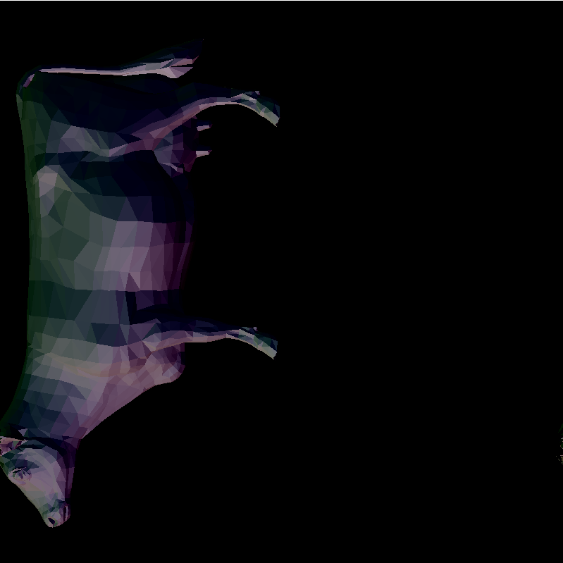
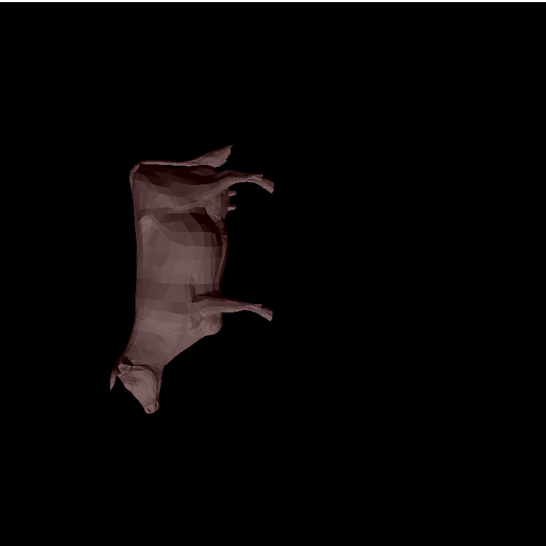
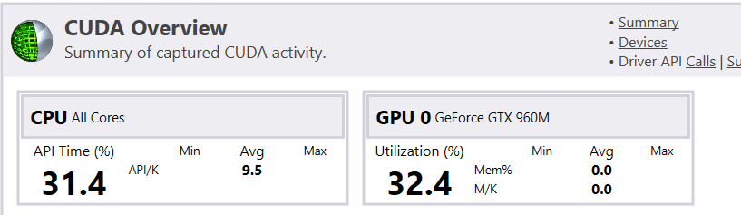
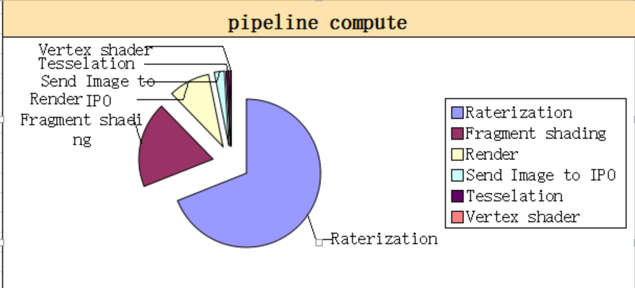

# CUDA Rasterizer

**University of Pennsylvania, CIS 565: GPU Programming and Architecture, Project 4**

* Zhimin Zhao
* Tested on: Windows 10, i7- @ 2.22GHz 22GB, GTX 960M

## Description:
 
This is a rasterizer.

It includes the following pipeline: 
1)vertex transformation with camera movement 
2)Tessellation shader 
3)Bling-phong shader and blending 
4)rasterization brute force scan line->boundingbox scan line 
5)depth test 
6)anti-aliansing:Super sampling - random   
the base color is normal map 
   

## Performance Analysis

The CPU are all used for opengl related funtions. The computation mostly happened in GPU

 a breakdown of time spent in each pipeline stage 

